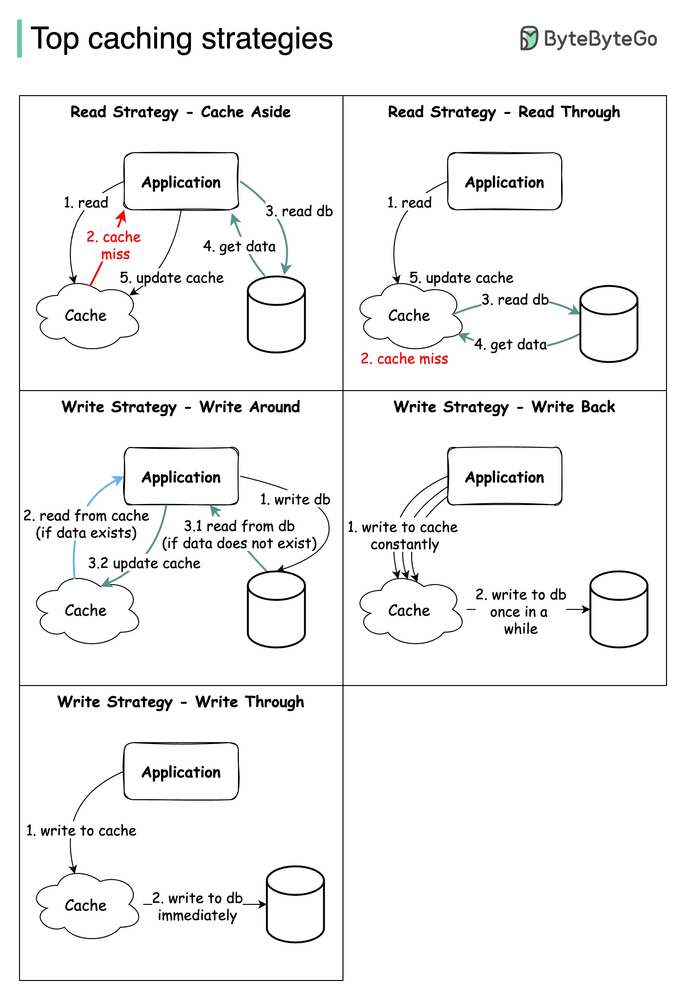

# caching-strategies

In this repo, I will implement 5 most popular caching strategies as per the diagram below,



## Getting started

### How to run
Please run the following comand to start application:

```
docker compose up -d
```

and check the log by this comand:

```
docker logs -f cs
```

### How to run load test

For instance, I want to test with a file named `script.js` and write a report file named `result.txt`:

```
make test in=test/script.js out=report/result.txt
```

## Reference
- [Bytebytego](https://blog.bytebytego.com/)